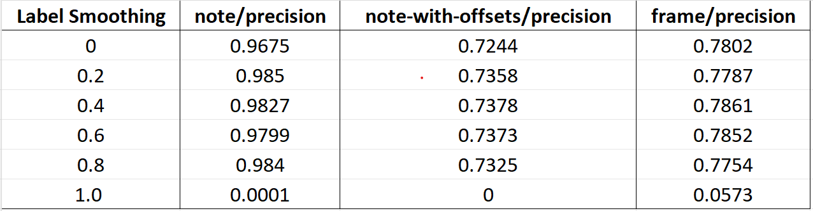
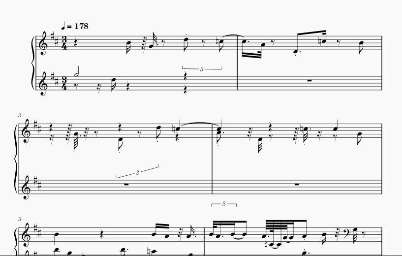

# Re-implementation of Polyphonic Piano Transcription

This is a re-implementation of [Dasam et al.'s](https://arxiv.org/abs/2010.01104) multi-state autoregressive AMT model.

## Directory Structure
```
├── LICENSE
├── __pycache__
│   ├── evaluate.cpython-310.pyc
│   └── evaluate.cpython-311.pyc
├── data
│   └── prepare_maestro.sh
├── evaluate.py
├── evaluate_make_csv.py
├── evaluate_test.sh
├── legacy
│   └── train.py
├── make_csv.py
├── metrics
├── onsets_and_frames
│   ├── ConvStack-shift0-1000000-transcriber-231117-105545.csv
│   ├── __init__.py
│   ├── __pycache__
│   │   ├── __init__.cpython-310.pyc
│   │   ├── __init__.cpython-311.pyc
│   │   ├── constants.cpython-310.pyc
│   │   ├── constants.cpython-311.pyc
│   │   ├── dataset.cpython-310.pyc
│   │   ├── dataset.cpython-311.pyc
│   │   ├── decoding.cpython-310.pyc
│   │   ├── decoding.cpython-311.pyc
│   │   ├── lstm.cpython-310.pyc
│   │   ├── lstm.cpython-311.pyc
│   │   ├── mel.cpython-310.pyc
│   │   ├── mel.cpython-311.pyc
│   │   ├── midi.cpython-310.pyc
│   │   ├── midi.cpython-311.pyc
│   │   ├── transcriber.cpython-310.pyc
│   │   ├── transcriber.cpython-311.pyc
│   │   ├── utils.cpython-310.pyc
│   │   └── utils.cpython-311.pyc
│   ├── constants.py
│   ├── dataset-original.py
│   ├── dataset.py
│   ├── decoding.py
│   ├── lstm.py
│   ├── mel.py
│   ├── mel_orig.py
│   ├── midi.py
│   ├── transcriber.py
│   └── utils.py
├── requirements.txt
├── test.ipynb
├── train_copy.py
└── transcribe.py
```

## Experiment Result

'

Below is an image that shows one of the predicted scores from the ASR model

'


Here is a [Demo Video](https://drive.google.com/file/d/1n9NULtk3E22ymLHmmmjRcMkback2Kt1S/view?usp=drive_link) of our result.


Below is the README of the [original repository](https://github.com/jdasam/low-latency-amt/blob/master/README.md)

## Instructions

This project is quite resource-intensive; 32 GB or larger system memory and 8 GB or larger GPU memory is recommended. 

### Downloading Dataset

The `data` subdirectory already contains the MAPS database. To download the Maestro dataset, first make sure that you have `ffmpeg` executable and run `prepare_maestro.sh` script:

```bash
ffmpeg -version
cd data
./prepare_maestro.sh
```

This will download the full Maestro dataset from Google's server and automatically unzip and encode them as FLAC files in order to save storage. However, you'll still need about 200 GB of space for intermediate storage.

### Training

All package requirements are contained in `requirements.txt`. To train the model, run:

```bash
pip install -r requirements.txt
python train.py
```


```bash
python train.py  --iterations=45000 --checkpoint_interval=45000
```

### Testing

To evaluate the trained model using the MAPS database, run the following command to calculate the note and frame metrics:

```bash
python evaluate.py runs/model/model-100000.pt --save-path output/
```

## Implementation Details

This implementation contains a few of the additional improvements on the model that were reported in the Maestro paper, including:

* Offset head
* Increased model capacity, making it 26M parameters by default
* Gradient stopping of inter-stack connections
* L2 Gradient clipping of each parameter at 3
* Using the HTK mel frequencies

Meanwhile, this implementation does not include the following features:

* Variable-length input sequences that slices at silence or zero crossings
* Harmonically decaying weights on the frame loss

Despite these, this implementation is able to achieve a comparable performance to what is reported on the Maestro paper as the performance without data augmentation.
