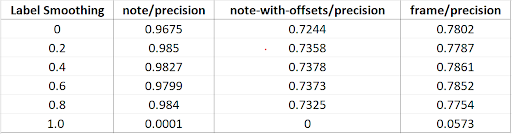

# Re-implementation of Polyphonic Piano Transcription

This is a re-implementation of [Dasam et al.'s]([https://arxiv.org/abs/2010.01104]) multi-state autoregressive AMT model.

## Directory Structure
```
├── LICENSE
├── __pycache__
│   ├── evaluate.cpython-310.pyc
│   └── evaluate.cpython-311.pyc
├── data
│   └── prepare_maestro.sh
├── evaluate.py
├── evaluate_make_csv.py
├── evaluate_test.sh
├── legacy
│   └── train.py
├── make_csv.py
├── metrics
├── onsets_and_frames
│   ├── ConvStack-shift0-1000000-transcriber-231117-105545.csv
│   ├── __init__.py
│   ├── __pycache__
│   │   ├── __init__.cpython-310.pyc
│   │   ├── __init__.cpython-311.pyc
│   │   ├── constants.cpython-310.pyc
│   │   ├── constants.cpython-311.pyc
│   │   ├── dataset.cpython-310.pyc
│   │   ├── dataset.cpython-311.pyc
│   │   ├── decoding.cpython-310.pyc
│   │   ├── decoding.cpython-311.pyc
│   │   ├── lstm.cpython-310.pyc
│   │   ├── lstm.cpython-311.pyc
│   │   ├── mel.cpython-310.pyc
│   │   ├── mel.cpython-311.pyc
│   │   ├── midi.cpython-310.pyc
│   │   ├── midi.cpython-311.pyc
│   │   ├── transcriber.cpython-310.pyc
│   │   ├── transcriber.cpython-311.pyc
│   │   ├── utils.cpython-310.pyc
│   │   └── utils.cpython-311.pyc
│   ├── constants.py
│   ├── dataset-original.py
│   ├── dataset.py
│   ├── decoding.py
│   ├── lstm.py
│   ├── mel.py
│   ├── mel_orig.py
│   ├── midi.py
│   ├── transcriber.py
│   └── utils.py
├── requirements.txt
├── test.ipynb
├── train_copy.py
└── transcribe.py
```

## Experiment Result

'


